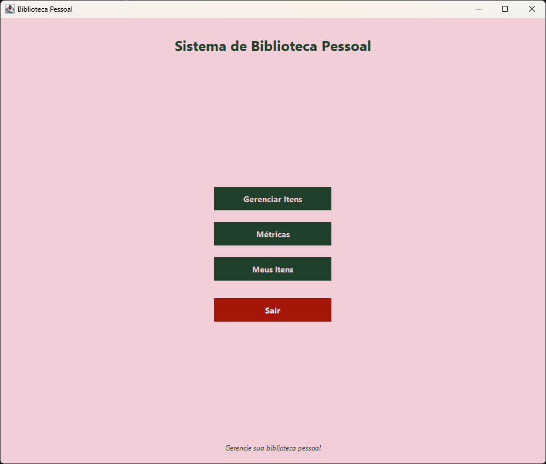
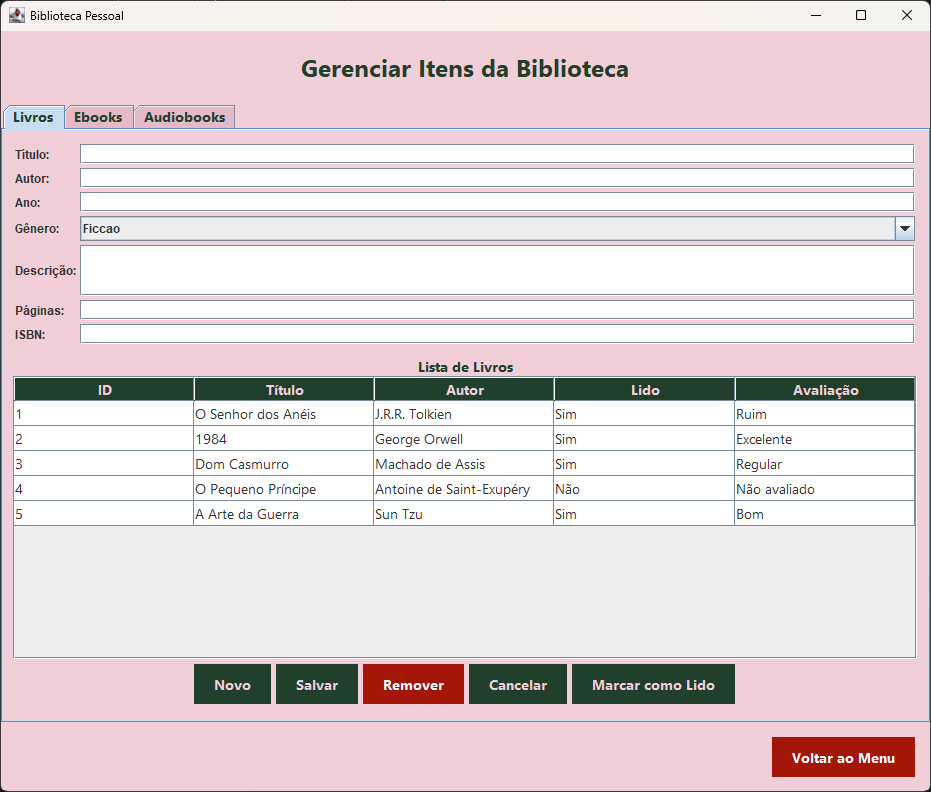
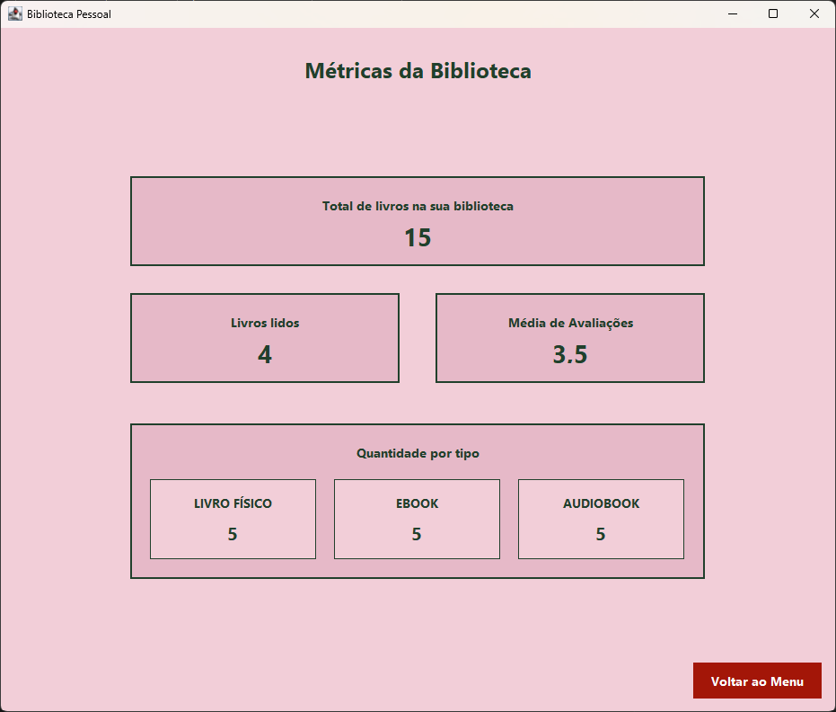
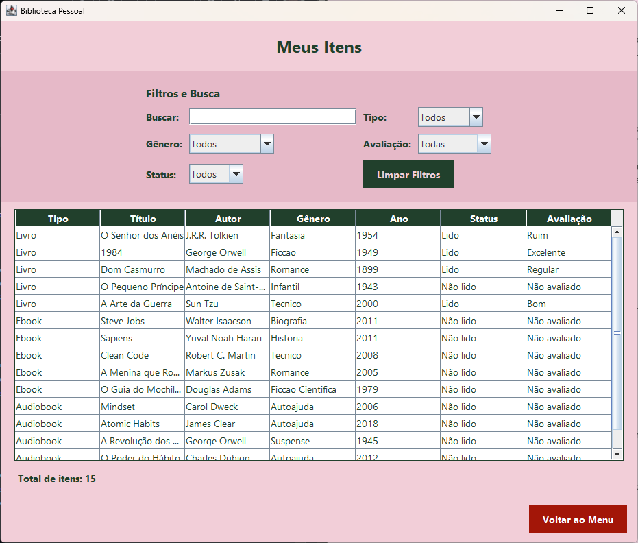

# 📚 Gerenciamento de Biblioteca Pessoal


## 🚧 Status do Projeto

**🔄 EM ANDAMENTO** - O projeto está sendo desenvolvido e aprimorado continuamente.

## Descrição do Projeto

Sistema de gerenciamento de biblioteca pessoal desenvolvido em Java com interface gráfica Java Swing. Esta solução foi criada para ajudar usuários a gerenciar sua coleção pessoal de livros, ebooks e audiobooks de forma simples e intuitiva, oferecendo funcionalidades completas para catalogação, avaliação e acompanhamento de leitura.

## ✨ Funcionalidades Principais

  - **Gerenciamento Completo (CRUD):** Adicione, edite e remova Livros, Ebooks e Audiobooks.
  - **Acompanhamento de Progresso:** Marque itens como "Lidos" ou "Não Lidos".
  - **Sistema de Avaliação:** Atribua notas de 1 a 5 estrelas para os itens que você já leu.
  - **Visualização Unificada:** Uma tela "Meus Itens" que exibe toda a sua coleção com filtros avançados por texto, tipo, gênero, avaliação e status.
  - **Dashboard de Métricas:** Visualize estatísticas sobre sua biblioteca, como total de itens, progresso de leitura e média de avaliações.

## 🖼️ Telas da Aplicação

<table>
  <tr>
    <td align="center"><strong>Menu Principal</strong></td>
    <td align="center"><strong>Gerenciamento de Itens</strong></td>
  </tr>
  <tr>
    <td></td>
    <td></td>
  </tr>
  <tr>
    <td align="center"><strong>Tela de Métricas</strong></td>
    <td align="center"><strong>Tela Meus Itens</strong></td>
  </tr>
   <tr>
    <td></td>
    <td></td>
  </tr>
</table>

## 🛠️ Tecnologias Utilizadas

- **Java** - Linguagem de programação principal
- **Java Swing** - Interface gráfica do usuário
- **Paradigma Orientado a Objetos** - Estrutura do código
- **Arquitetura MVC** (Model-View-Controller)

## 🏛️ Estrutura do Projeto

O projeto foi modularizado seguindo o padrão de arquitetura **Model-View-Controller (MVC)** para garantir a separação de responsabilidades e facilitar a manutenção:

  - #### 📦 `br.edu.ifms.model` (Model)

    Representa os dados e a lógica de negócio. Contém a classe abstrata `Item` e suas especializações (`Livro`, `Ebook`, `Audiobook`), além de Enums (`Genero`, `Nota`) para garantir a integridade dos dados.

  - #### 🖥️ `br.edu.ifms.view` (View)

    Responsável pela apresentação e interface do usuário. Organizada em sub-pacotes `frames`, `panels` e `styles` para uma UI consistente e reutilizável.

  - #### 🕹️ `br.edu.ifms.controller` (Controller)

    Atua como intermediário, tratando os eventos da View (cliques de botão), acionando validações e atualizando o Model.

  - #### 🛡️ `br.edu.ifms.exception` (Exceptions & Validation)

    Contém exceções customizadas e a classe `Validador` para garantir a robustez e a integridade dos dados inseridos pelo usuário.


## 📋 Pré-requisitos

- Java JDK 11 ou superior
- IDE Java (recomendado: IntelliJ IDEA, Eclipse ou NetBeans)

## 🚀 Como Executar

1.  **Clone o repositório:**

    ```bash
    git clone https://github.com/RhafaelyReis/gerenciamento-biblioteca-pessoal.git
    ```

2.  **Abra na sua IDE:**

      - Abra o projeto clonado na sua IDE de preferência.

3.  **Execute a aplicação:**

      - Encontre o arquivo `src/br/edu/ifms/Main.java`.
      - Execute o método `main()` contido nesta classe.

## 📝 Validações e Tratamento de Erros

O sistema inclui validações robustas e exceções customizadas para garantir uma experiência de usuário segura e a integridade dos dados:

  - **`CampoObrigatorioException`**: Garante que campos essenciais (título, autor, etc.) não fiquem em branco.
  - **`CampoInvalidoException`**: Valida regras de negócio (ex: ano de publicação não pode ser no futuro, número de páginas deve ser positivo).
  - **`FormatoInvalidoException`**: Assegura que valores numéricos (ano, páginas) sejam inseridos corretamente.
  - **`ItemNaoSelecionadoException`**: Impede ações de remoção ou edição sem que um item esteja selecionado na tabela.
  - **`DispositivoInvalidoException`**: Valida se o dispositivo inserido para um Ebook corresponde a uma lista de valores permitidos.

## 🎯 Regras de Negócio

  - **Avaliação Condicionada**: Apenas itens marcados como "lidos" podem receber avaliações.
  - **ID Automático**: O sistema gera identificadores únicos e sequenciais para cada item cadastrado.
  - **Estatísticas Calculadas**: As estatísticas da coleção são calculadas e exibidas ao se acessar a tela "Métricas".

## 🔄 Fluxo de Uso

1. **Cadastro**: Adicione novos itens à biblioteca
2. **Organização**: Use filtros e busca para encontrar itens específicos
3. **Acompanhamento**: Marque itens como lidos conforme avança
4. **Avaliação**: Classifique obras lidas para referência futura
5. **Análise**: Visualize estatísticas para insights sobre seus hábitos de leitura

## 🤝 Contribuição

Contribuições são bem-vindas! Sinta-se à vontade para:
- Reportar bugs
- Sugerir melhorias
- Enviar pull requests

## 📄 Licença

Este projeto está sob a licença MIT. Veja o arquivo LICENSE para mais detalhes.

## 👩‍💻 Desenvolvedora

Projeto desenvolvido como parte do aprendizado em programação Java e desenvolvimento de interfaces gráficas.

---

*Organize sua biblioteca pessoal de forma inteligente e nunca mais perca o controle das suas leituras!* 📖✨
